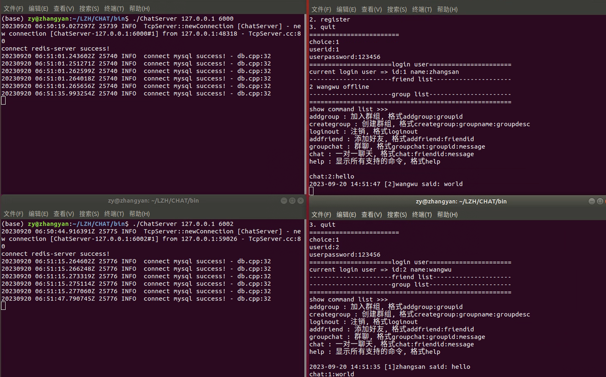
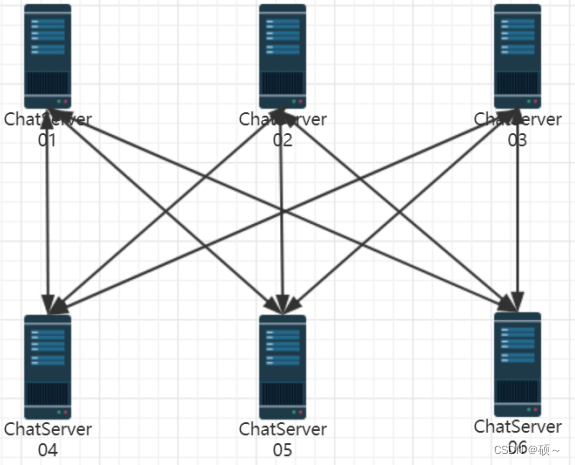
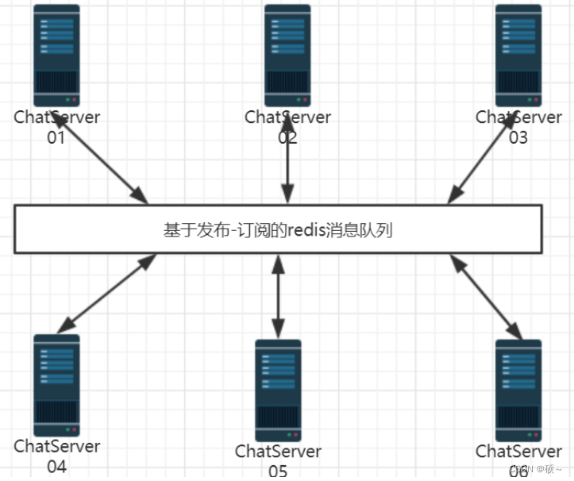

# Cluster chatserver

## 项目简介
该项目基于 C/S 架构实现的聊天系统。实现新用户注册、用户登录、添加好友、添加群组、好友通信、
群组聊天、保持离线消息等功能。数据通信采用 Json 格式字符串，服务器使用集群式服务，负载均衡器使用 Nginx tcp
长连接负载均衡算法，服务器之间使用基于发布-订阅模式的 Redis 消息中间件进行通信。

## 技术栈
+ 使用第三方 JSON 库实现通信数据的序列化和反序列化
+ 基于 muduo 网络库开发网络核心模块，实现高效通信
+ 使用 Nginx 的 TCP 负载均衡功能，将客户端请求分派到多个服务器上，以提高并发处理能力
+ 基于发布-订阅的服务器中间件redis消息队列，解决跨服务器通信难题
+ 封装 MySQL 接口，将用户数据储存到磁盘中，实现数据持久化
+ 基于 CMake 构建项目

## 效果展示

## 编译环境配置
1. ubuntu（18.04及以上）或者centos 7
2. 安装Json开发库
3. 安装boost + muduo网络库开发环境
4. 安装mysql数据库环境
5. 安装redis环境
6. 安装nginx tcp
7. 安装CMake环境

### VScode远程开发
使用VSCode远程开发有很多的优势，能够使用本地的图形化界面，统一的开发环境和更高的安全性。
具体安装方法可以参考：https://blog.csdn.net/irober/article/details/112724986

### Json开发库的安装使用
本项目使用的是nlohmann大神开发的Json库，使用起来非常方便，只需要在项目中添加json.hpp头文件即可使用。
Json库下载地址；https://github.com/nlohmann/json

使用示例：
``` js
#include <iostream>
#include "json.hpp"
using json = nlohmann::json;
using namespace std;
int main() {
	json js ; // 生成js对象
	js["key"] = {"value"} // js对象加入键值对
	js.dump() // js序列化成字符串
	cout << js << endl;
	// 反序列化
	Js = json::parse(js);
	// 通过键来查值
	cout << js["key"] << endl;
	return 0;
}
``` 
### 安装boost + muduo网络库开发环境
muduo由陈硕大佬开发（源码链接放在文章最后），是一个基于非阻塞IO和事件驱动的C++高并发TCP网络库，使用的线程模型是one loop per thread。
通过使用muduo可以极大程度上简化开发过程。
具体安装方法可以参考：https://blog.csdn.net/QIANGWEIYUAN/article/details/89023980?spm=1001.2014.3001.5502

### 安装nginx tcp
官网下载地址：http://nginx.org/en/download.html

安装nginx需要先安装pcre、openssl、zlib库

	sudo apt-get install openssl libssl-dev
	sudo apt-get install libpcre3 libpcre3-dev
	sudo apt-get install zlib1g-dev

本项目使用到TCP协议进行数据交互，通过nginx进行反向代理。在安装的时候编译命令需要增加支持TCP协议的stream模块。
	
	cd nginx-1.24.0
	sudu su
	./configure --with-stream
	make && make install
	cd /usr/local/nginx

使用vim修改nginx.conf文件配置

	stream{
		upstream tcpstream{
			# hash $remote_addr consistent;
			server 127.0.0.1:6000 weight=1 max_fails=3 fail_timeout=30s;
            server 127.0.0.1:6002 weight=1 max_fails=3 fail_timeout=30s;
		}
		server{
            proxy_connect_timeout 1s;
            #proxy_timeout 3s;
            listen 8000;
            proxy_pass MyServer;
            tcp_nodelay on;
		}
	}
其中两个IP地址即为nginx代理的两台服务器地址，因为本项目设计均在一台服务器进行因此这里用到的两个IP地址均为
本机环回地址。weight表示两台服务器的优先优先权重，max_fails表示心跳链接允许的最大失败次数。
	
	cd /usr/local/nginx/sbin
	./nginx -s reload  # 重新加载配置文件
	./nginx -s stop  # nginx不能被kill命令彻底杀死，需要使用该命令停止
	./nginx -s start  # 启动nginx服务

### 安装redis环境
redis服务器端安装
	
	sudo apt-get install redis-server
redis客户端安装
redis支持多种不同的客户端编程语言，例如Java对应jedis、php对应phpredis、C++对应的则是hiredis。下面是hiredis安装步骤：
	
	git clone https://github.com/redis/hiredis
	cd hiredis
	sudu su
	make
	make install
	sudo ldconfig /usr/local/lib

## 项目讲解
### 1. 数据库表设计
<p><strong>User表</strong></p> 
<table><thead><tr><th>字段名称</th><th>字段类型</th><th>字段说明</th><th>约束</th></tr></thead><tbody><tr><td>id</td><td>INT</td><td>用户id</td><td>PRIMARY KEY、AUTO_INCREMENT</td></tr><tr><td>name</td><td>VARCHAR(50)</td><td>用户名</td><td>NOT NULL, UNIQUE</td></tr><tr><td>password</td><td>VARCHAR(50)</td><td>用户密码</td><td>NOT NULL</td></tr><tr><td>state</td><td>ENUM(‘online’, ‘offline’)</td><td>当前登录状态</td><td>DEFAULT ‘offline’</td></tr></tbody></table> 
<p><strong>Friend表</strong></p> 
<table><thead><tr><th>字段名称</th><th>字段类型</th><th>字段说明</th><th>约束</th></tr></thead><tbody><tr><td>userid</td><td>INT</td><td>用户id</td><td>NOT NULL、联合主键</td></tr><tr><td>friendid</td><td>INT</td><td>好友id</td><td>NOT NULL、联合主键</td></tr></tbody></table> 
<p><strong>AllGroup表</strong></p> 
<table><thead><tr><th>字段名称</th><th>字段类型</th><th>字段说明</th><th>约束</th></tr></thead><tbody><tr><td>id</td><td>INT</td><td>组id</td><td>PRIMARY KEY、AUTO_INCREMENT</td></tr><tr><td>groupname</td><td>VARCHAR(50)</td><td>组名称</td><td>NOT NULL, UNIQUE</td></tr><tr><td>groupdesc</td><td>VARCHAR(200)</td><td>组功能描述</td><td>DEFAULT ‘’</td></tr></tbody></table> 
<p><strong>GroupUser表</strong></p> 
<table><thead><tr><th>字段名称</th><th>字段类型</th><th>字段说明</th><th>约束</th></tr></thead><tbody><tr><td>groupid</td><td>INT</td><td>组id</td><td>NOT NULL、联合主键</td></tr><tr><td>userid</td><td>INT</td><td>组员id</td><td>NOT NULL、联合主键</td></tr><tr><td>grouprole</td><td>ENUM(‘creator’, ‘normal’)</td><td>组内角色</td><td>DEFAULT ‘normal’</td></tr></tbody></table> 
<p><strong>OfflineMessage表</strong></p> 
<table><thead><tr><th>字段名称</th><th>字段类型</th><th>字段说明</th><th>约束</th></tr></thead><tbody><tr><td>userid</td><td>INT</td><td>用户id</td><td>NOT NULL</td></tr><tr><td>message</td><td>VARCHAR(50)</td><td>离线消息&#xff08;存储Json字符串&#xff09;</td><td>NOT NULL</td></tr></tbody></table> 

### 2. 网络模块设计
Muduo网络库：底层实质上为Linux的epoll + pthread线程池，且依赖boost库。 muduo的网络设计核心为一个线程
一个事件循环，有一个main Reactor负载accept连接，然后把连接分发到某个sub Reactor(采用轮询的方式来选择
sub Reactor)，该连接的所用操作都在那个sub Reactor所处的线程中完成。多个连接可能被分派到多个线程中，
以充分利用CPU，Reactor poll的大小是固定的，根据CPU的数目确定。如果有过多的耗费CPU I/O的计算任务，
可以提交到创建的ThreadPool线程池中专门处理耗时的计算任务。
muduo给用户提供了两个主要的类：
1、TcpServer：用于编写服务器程序。
2、TcpClient：用于编写客户端程序。

### 3. 业务模块设计
**注册模块**

从json 对象中获取用户ID和用户密码。并以此生成 User 对象，并将新注册的用户数据插入到User表中。

**登录模块**

从 json 对象中获取用户ID和密码，并在User表中查询获取用户信息是否匹配。如果用户已经登录过，即 state = "online"，则返回错误信息。
登录成功后需要在改服务端的User表中更改状态state = "online"，并显示该用户的好友列表和收到的离线消息。

**客户端异常退出模块**

如果客户端异常退出了，从User表中找到该用户，将其状态设置为 "offline"。

**服务端异常退出模块**

如果服务端异常退出，会将所有在线的客户的状态都设置为 "offline"。

**点对点聊天模块**

通过传递的 json 查找对话用户 ID：
+ 用户处于登录状态：直接向该用户发送信息
+ 用户处于离线状态：需存储离线消息

**添加好友模块**

从 json 对象中获取添加登录用户ID和好友ID，在Friend表中插入好友信息。

**群组模块**

创建群组需要描述群组名称，群组的描述，然后在AllGroup表中记录新群组信息。
加入群组需要给出用户ID和想要加入群组的ID，其中会显示该用户是群组的普通成员还是创建者。
群组聊天给出群组ID和聊天信息，群内成员在线会直接接收到。

### 4. Nginx负载均衡模块
1、为什么要集群服务器？
一台服务器上的文件描述符是有限的，32位操作系统大约支持2w左右的并发量，一旦客户端非常多时业务就无法正常支持了。
此时就需要集群或分布式的部署了，引入多台服务器增加并发量。

2、集群服务器为什么要引入负载均衡器？
引入集群后，扩展了多台主机为用户提供服务，但用户使用时并不需要知道连接那台服务器，
因此就服务器集群环境中需要引入负载均衡器(反向代理)设备。负载均衡设备统一接收客户端请求，
依据特殊的负载算法(轮询、权重、哈希、一致性哈希算法等)将客户端的请求均衡的分发到每个服务器上，
本项目选择使用nginx的tcp负载均衡模块。

3、负载均衡器主要作用：
+ 将客户端请求按照负载均衡算法分发到具体的业务服务器上，再将服务器的响应经过负载均衡器转发给客户端；
+ 能够和服务器保持心跳机制，检测服务器故障，增加容错率；
+ 能够发现新添加的服务器设备，且不影响原本服务器工作，平滑加载配置文件来扩容；

### 5. Nginx负载均衡模块
如何解决跨服务器聊天问题?
我们客户端聊天业务主要涉及一对一聊天与群聊功能，一旦涉及跨服务器通信，本台服务器维护的_userConnMap表无法识别其它服务器上用户是否在线，并且用户之间的通信过程逻辑会变得异常复杂。
解决方案一：让各个聊天服务器互相之间直接建立TCP连接进行通信，相当于在服务器网络之间进行广播。
这样的会设计使得各个服务器之间耦合度太高，不利于系统扩展，并且会占用系统大量的socket资源，
各服务器之间的带宽压力很大，不能够节省资源给更多的客户端提供服务。



解决方案二：集群部署的服务器之间进行通信，最好的方式就是引入中间件消息队列，解耦各个服务器，
使整个系统松耦合，提高服务器的响应能力，节省服务器的带宽资源。
在集群分布式环境中，经常使用的中间件消息队列有ActiveMQ、RabbitMQ、Kafka等，
都是应用场景广泛并且性能很好的消息队列，供集群服务器之间，分布式服务之间进行消息通信。
本项目业务类型并不是非常复杂，对并发请求量也没有太高的要求，
因此中间件消息队列选型的是基于发布-订阅模式的redis。


___
参考博客：

[1] https://blog.csdn.net/irober/article/details/112724986

[2] https://blog.csdn.net/QIANGWEIYUAN/article/details/89023980?spm=1001.2014.3001.5502

[3] https://blog.csdn.net/weixin_46272577/article/details/126996475

[4] https://blog.csdn.net/qq_42441693/article/details/129167974?spm=1001.2014.3001.5502

[5] https://blog.csdn.net/qq_42441693/article/details/128923253?spm=1001.2014.3001.5502

[6] https://blog.csdn.net/qq_42441693/article/details/129013429?spm=1001.2014.3001.5502

